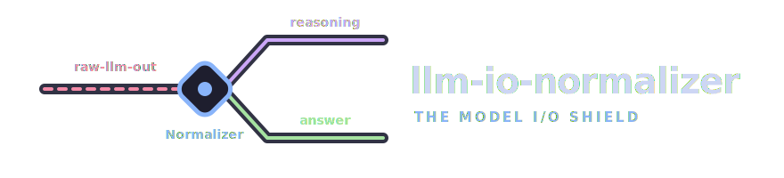
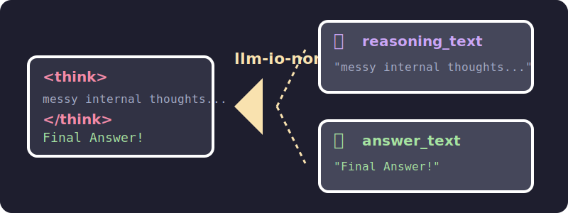

# llm-io-normalizer

<!-- markdownlint-disable MD033 -->
<div align="center">
  
</div>
<!-- markdownlint-enable MD033 -->

---

<!--   -->
[](https://pypi.org/project/llm-io-normalizer/) [](https://www.python.org/downloads/) [](https://opensource.org/licenses/MIT)

**`llm-io-normalizer`** is a lightweight, production-ready **Model I/O normalization layer** for OpenAI-compatible LLM APIs. 

As reasoning models (like DeepSeek) become mainstream, the way providers return "thoughts" is highly fragmented. Some use native `reasoning_content` fields, while others mix `<think>...</think>` tags directly into the final output. Furthermore, stream interruptions and missing tags often leak private reasoning logic into user-facing answers.

**`llm-io-normalizer` acts as an impenetrable shield.** It provides a rock-solid, unified data contract so your business code never has to parse a `<think>` tag, handle broken streams, or guess provider-specific fields again.

> This package is intentionally **not** a full API gateway. It does not implement authentication, rate limiting, or billing. It focuses purely on the reusable Python SDK layer for Model I/O normalization and reasoning extraction.

---

<!-- ## TL;DR - Getting Started -->
## Quick Start

With `llm-io-normalizer` you can easily setup your LLM calls, reliably extract the reasoning process, and get a clean final answer without worrying about provider differences.

1. **Install the SDK**

```bash
pip install llm-io-normalizer
```

2. **Setup your Gateway, Request, and generate responses**

```python
import asyncio
from llm_io_normalizer import LLMGateway, LLMRequest

async def main():
    # 1. Initialize your Gateway
    gateway = LLMGateway()

    # 2. Make a request (Handles stream/non-stream & tag extraction automatically)
    result = await gateway.generate(
        LLMRequest(
            model_name="deepseek-reasoner",
            base_url="[https://api.your-provider.com/v1](https://api.your-provider.com/v1)",
            api_key="YOUR_API_KEY",
            messages=[{"role": "user", "content": "Explain quantum physics."}],
            stream=True,           # Streams by default
            enable_thinking=True,  # Enable reasoning if supported
        )
    )

    # 3. Ensure the call was successful
    result.require_ok()
    
    # Get Clean Reasoning Output
    print(f"Thoughts: {result.reasoning_text}") 
    
    # Get Clean Final Answer (Guaranteed no <think> tags!)
    print(f"Answer: {result.answer_text}")

asyncio.run(main())
```

3. **Leverage the JSON output helper**

```python
from llm_io_normalizer.normalizers import extract_json_object

# Easily extract strict JSON from markdown-wrapped LLM responses
obj = extract_json_object('Here is the result: ```json\n{"score": 95}\n```')
assert obj == {"score": 95}
```

---

## Project Structure
- [Usage](#usage)
- [Local Development](#local-development)
  - [Prerequisites and Dependencies](#prerequisites-and-dependencies)
  - [Setup](#setup)
- [Configuration](#configuration)
  - [Provider Field Mapping](#provider-field-mapping)
- [Architecture](#architecture)
  - [Reasoning Extraction Engine](#reasoning-extraction-engine)
  - [Resilience & Fallback](#resilience-fallback)
- [Contributing](#contributing)
- [License](#license)

<a id="usage"></a>
### Usage
The public contract of LLMResult is intentionally small, stable, and predictable. Business code should depend on these normalized fields instead of reading raw provider fields directly.

```python
result.answer_text       # Pure, final answer content
result.reasoning_text    # Extracted thinking process
result.ok                # True if a valid answer was extracted
result.error_type        # Categorized error (e.g., "EMPTY_ANSWER")
result.error_message     # Detailed error description
```

<a id="local-development"></a>
### Local Development
Below is a guide on setting up a local environment for contributing to or testing the llm-io-normalizer package.

<a id="prerequisites-and-dependencies"></a>
#### Prerequisites and Dependencies
The project is developed using python. The minimum python version required is 3.10.


<a id="setup"></a>
#### Setup

1. **Clone the repository**
```bash
git clone https://github.com/wanghesong2019/llm-io-normalizer.git
cd llm-io-normalizer
```

2. **Install development dependencies**
It is recommended to use a virtual environment. Once activated, install the package in editable mode along with testing tools:
```bash
pip install -e ".[dev]"
```
3. **Run the test suite**
The project includes a robust suite of unit and mock tests to ensure the extraction engine and fallback mechanisms work flawlessly.
```bash
# Run linting
ruff check .

# Run tests
pytest -v
```

<a id="configuration"></a>
### Configuration

`llm-io-normalizer` uses a flexible configuration system that allows you to adapt to any OpenAI-compatible provider without waiting for library updates.

<a id="provider-field-mapping"></a>
#### Provider Field Mapping

Different proxy providers use different fields (reasoning_content, thoughts, reason) to return intermediate thoughts. You can seamlessly map any provider's custom schema by passing a ProviderFieldMapping during initialization:

```python
from llm_io_normalizer import OpenAICompatibleGateway, ProviderFieldMapping

# Define custom fields for a new provider
custom_mapping = ProviderFieldMapping(
    content_fields=("message_body", "text"),
    reasoning_fields=("chain_of_thought", "deep_thought")
)

# Initialize gateway with custom mapping
gateway = OpenAICompatibleGateway(field_mapping=custom_mapping)
```

<a id="architecture"></a>
### Architecture

<!-- markdownlint-disable MD033 -->
<div align="center">
  
</div>
<!-- markdownlint-enable MD033 -->

<a id="reasoning-extraction-engine"></a>
#### Reasoning Extraction Engine

The internal normalizer algorithm is rigorously tested against edge cases to ensure private reasoning logic never leaks into user-facing answers. It handles:
  - **Multiple Tags**: Alternating between thoughts and answers multiple times.
  - **Unclosed Tags**: Stream interruptions or token limits that leave unclosed `<think>` tags at the end of the text.
  - **Redundant Data**: Mixes of native provider reasoning fields with redundant text tags in the main content.

The engine processes these anomalies and produces clean answer_text and reasoning_text strings.
<a id="resilience-fallback"></a>
#### Resilience & Fallback

Network jitter and API quirks often result in dropped tokens or stuck states. `llm-io-normalizer` implements an automatic safety net (which can be toggled via `LLMRequest` parameters):
  - **Stream → Non-Stream Fallback (fallback_to_non_stream)**: If a stream ends prematurely leaving only thoughts and an EMPTY_ANSWER, it automatically retries with stream=False.
  - **Thinking → Non-Thinking Retry (retry_without_thinking_when_empty)**:  If the model gets stuck in an infinite thought loop and consumes all tokens without giving a final answer, it can automatically retry with enable_thinking=False.

<a id="contributing"></a>
### Contributing

We welcome contributions! Please feel free to submit a Pull Request or open an Issue for bug reports and feature requests. Ensure all tests pass (pytest) before submitting a PR.

<a id="license"></a>
### License

This project is licensed under the MIT License.